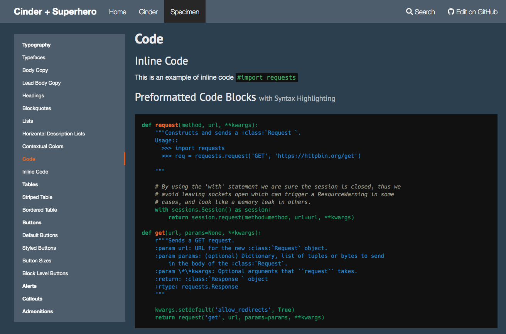

disable_toc: true

  <h1>Cinder + Superhero</h1>
  
&nbsp;

  
<a class="btn btn-primary btn-lg" href="/cinder/" role="button">Learn more</a>
  <a class="btn btn-warning btn-lg" href="/specimen/" role="button">Theme</a>

A Superhero-inspired theme based on Cinder for MKDocs

* Cinder: http://sourcefoundry.org/cinder/
* Superhero: https://bootswatch.com/superhero/
* MKDocs: https://www.mkdocs.org

## This is how documentation will look like:

## Usage:
* Install MKDocs according to https://www.mkdocs.org/#installation
* Run `mkdocs serve` to host a live version of your documents, watch them at http://localhost:8000/
* Run `mkdocs build` to make a static web page out of your documentation inside `site`
* Edit the documentation markdown files in `docs` to make your own documentation

## Why? Why???
The original Cinder implementation is great but has some design decisions which are fixed here:

* For a **privacy-aware** implementation we do not want any external links. Therefore all context, loaded by CDNs or other sources (google etc.) had been either removed or completely embedded. This MKDocs theme is now privacy-aware!
* The **very bright appearance** of Cinder does not fit Programming-oriented colour styles where we prefer a dark appearance. As a reference the superhero implementation is the best place to steal styles and colours. So this is like the dark version of Cinder.

